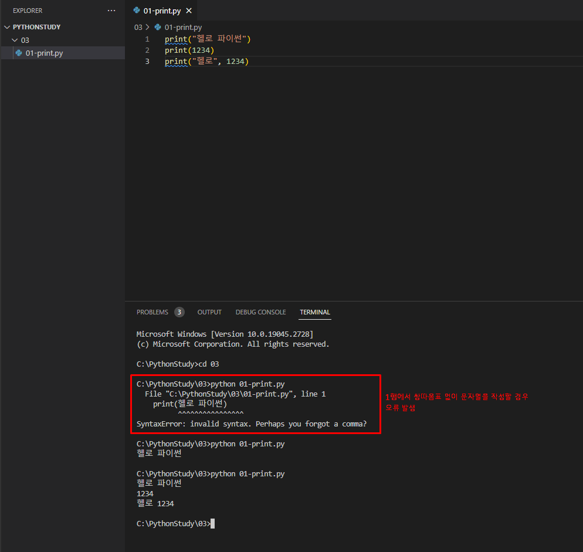

# Python 학습 정리

해당 내용은 코딩은 처음이라 with 파이썬 교재를 학습한 내용을 기반으로 정리하였습니다.

## 파이썬(Python)이란

- 1991년에 발표한 인터프리터 방식의 프로그래밍 언어

  |                       interpretor 언어                       |                         Complie 언어                         |
  | :----------------------------------------------------------: | :----------------------------------------------------------: |
  | - 사용자가 입력한 코드를 한 줄씩 번역하며 즉시 실행하는 방식<br />ex) Python, Javascript, PHP, Ruby<br />- 코드 작성과 유지 보수에 유연<br />- 운영체제에 종속적이지 않음<br />- 인터프리트 단계와 실행 단계가 분리되어 있지 않아 반복 수행하여 실행 속도가 느림 | - 코드 실행 전, 컴파일을 통해 소스 코드 전체를 기계어로 변환 후 사용자에 의해 한번에 실행<br />ex) C, C++, C#, JAVA<br />- 컴파일과 실행단계가 분리되어 있어, 실행 시 속도가 빠름<br />- 단, 프로젝트의 규모가 클 경우 컴파일 시간이 오래 걸릴 수 있음 |

- 간결한 문법

- 높은 생산성

- 유연한 문법적 특성

- [TIOBE](https://www.tiobe.com/tiobe-index/) 기준 가장 많이 사용하고 있는 프로그래밍 언어 1위

<br />

## 파이썬 입출력

### 출력

- print() 함수를 이용하여 출력

- 문자열은 반드시 ""(쌍따옴표)로 감싸주어 사용

  👉 ""(쌍따옴표) 없이 문자열을 사용할 경우 아래와 같이 오류가 발생함

- 정수는 그대로 사용

- 서로 다른 타입의 자료형을 사용할 때에는 ,(콤마)를 이용하여 사용



### 입력

input() 함수를 이용하여 입력

```python
name = input("이름을 입력하세요 : ")
age = input("나이를 입력하세요 : ")
print(f"당신의 이름은 {name}이며, 나이는 {age}입니다.")
```

[3장 연습문제 코드](https://github.com/Soyeong4250/PythonStudy/blob/main/03/05-1.py)

- input 함수 내에 문자열을 작성하면 입력 대기 상태가 되기 전에 내용을 먼저 출력

  👉 사용자에게 현재 상태를 전달해줌으로써 조금 더 사용자 친화적인 프로그램 작성 가능

- f-string을 활용하여 문자열 포맷팅 활용

<br />

## 변수와 자료형

### 변수란? 

👉 변화하는 값

### 변수명 생성 규칙

- 영문 문자와 숫자 사용 가능

  👉 단, 숫자부터 시작하는 것은 ❌ (정수부터 나올 경우 정수 값으로 인식하기 때문)

- 대소문자를 구분

- 파이썬 변수 명으로 한글을 사용할 수 있으나 권장하지 ❌

  👉 한글은 유니코드 문자인데, 유니코드가 지원되지 않는 환경이 있을 수 있고, 파이썬 라이브러리 중 유니코드를 지원하지 않는 라이브러리도 있기 때문

- 변수 명에는 _(언더스코어)를 제외한 특수문자 사용 불가능

- 변수 명에는 띄어쓰기 불가능

- 미리 예약된 내장 키워드를 사용할 수 ❌

  ex) for, if, print, switch ...

### 자료형

👉 변수에 저장된 자료의 형태 

👉 변수가 포함하고 있는 값에 따라 자료형 결정 

|  자료형  | 클래스 명 | 설명                                                  |
| :------: | :-------: | ----------------------------------------------------- |
|   정수   |    int    | 음수, 양수를 포함하는 숫자 형태의 자료형              |
|   실수   |   float   | 소수점을 포함하는 실수 형태의 자료형                  |
|  문자열  |    str    | 문자 형태로 이루어진 자료형                           |
|  바이트  |   bytes   | 파일 데이터와 같은 Raw 데이터를 표현하기 위한 자료형  |
|    불    |   bool    | True나 False로 이루어진 자료형                        |
|  리스트  |   list    | 여러 개의 요소를 포함하며 값을 수정할 수 있는 자료형  |
|   튜플   |   tuple   | 여러 개의 요소를 포함하며 값을 수정할 수 없는 자료형  |
| 딕셔너리 |   dcit    | 키와 값, 한 쌍으로 이루어진 자료형                    |
|   집합   |    set    | 중복을 허용하지 않은 여러 개의 요소로 이루어진 자료형 |
|   None   |   None    | 값이 없다는 것을 의미하는 자료형                      |

<br />

### type() 함수

어떤 변수에 어떤 형태의 값이 담겨 있는지 확인할 수 있는 함수

<br />

### 1) 정수형 (int)

```python
a = 10  # a변수에 양수 10 저장
b = int(10)  # 변수 b에 int형 정수 10 저장
c = 900000000000000000000  # 변수 c에 9해의 값을 저장
d = -1000  # 변수 d에 음수 1000을 저장
print(a, type(a))
print(b, type(b))
print(c, type(c))
print(d, type(d))
```

👉 결과

```markdown
C:\PythonStudy\04>python 05-int.py
10 <class 'int'>
10 <class 'int'>
9000000000000000000000000000000000 <class 'int'>
-1000 <class 'int'>
```

- a와 b는 같은 내용의 코드

- c는 일반적인 프로그래밍 언어에서는 정수형 변수에 저장할 수 있는 수의 범위가 제한되어 있는데 반해 파이썬에서는 임의정밀도로 수를 관리하기 때문에 컴퓨터 메모리가 허락하는 한도 내에서 거의 제한없이 수를 저장 가능

​		👉 *임의정밀도*는 정수의 값을 숫자의 배열로 간주하여 처리하는 방식으로, 시스템 메모리가 허용하는 범위 안에서 무제한 자릿수를 제공하는 방식을 의미

### 2) 실수형 (float)

- 소수점을 포함하는 수의 값을 의미

- 부동소수점 방식으로 처리되는데 유한개 의 비트로 실제 정확한 값을 표현할 수 없어 근삿값으로 표현

```python
a = 0.1
b = float(10)
c = 0.33333333333333333
d = 0.333333333333333331
print(a, type(a))
print(b, type(b))
print(c, type(c))
print(d, type(d))
```

```markdown
C:\PythonStudy\04>python 06-float.py
0.1 <class 'float'>
10.0 <class 'float'>
0.3333333333333333 <class 'float'>
0.3333333333333333 <class 'float'>
```

- c와 d의 값이 똑같은 이유

​	👉 실수의 정밀도는 소수점 16자리까지만 표현이 가능하고 그 아래로는 컴퓨터가 신경쓰지 않음

​	👉 컴퓨터의 모든 값은 메모리에 올라가게 되는데 메모리의 크기는 유한하기 때문에 무한한 값을 메모리에 올릴 수 없으므로 16자리까지만 표현 가능

### 3) 문자형 (str)

- 문자 : 1개 이상의 문자

- 문자형 : 홑따옴표 혹은 상따옴표를 사용하여 정의 가능

- 문자열 안에 쌍따옴표가 들어가는 경우 문자열 정의를 홑따옴표로 정의하고, 문자열 안에 홑따옴표가 들어가는 경우 정의를 쌍따옴표로 정의

- 만약, 문자열 안에 쌍따옴표가 포함되어야 하는 경우 이스케이프 문자를 사용해서만 표현할 수 있음

  👉 이스케이프 문자 (Escape string)

  | 이스케이프 문자 | 문자의  의미 |
  | :-------------: | :----------: |
  |       \n        |   줄 바꿈    |
  |       \t        |      탭      |
  |       \\'       |   홑따옴표   |
  |       \"        |   쌍따옴표   |
  |       \\        |  역 슬래시   |

<br />

#### 문자열 인덱싱

- 하나의 변수에 한 개 이상의 문자를 저장하는 경우 저장된 문자열 안에서 특정 위치의 문자 1개를 구해오는 것

- 인덱스 위치 정보는 양의 정수일때는 좌측부터 시작 시 0부터 시작하며 최대 문자열 길이까지 지정할 수 있고, 반대로 문자열의 끝에서부터 접근할 때는 -1부터 시작하여 지정할 수 있음 (공백 포함)

⚠ 문자열 인덱스는 인덱스가 문자열의 범위를 벗어나면 오류가 발생

<br />

#### 문자열 슬라이싱

- 한 개 이상의 글자를 구해오는 것

```python
문자형 변수[시작 위치 : 끝 위치]
```

⚠ 문자열 슬라이싱에서는 인덱스 값을 생략할 수 있음

​	👉 시작 위치에 대한 인덱스 값을 생략하면 0을 의미하게 되고 끝 위치에 대한 인덱스 값을 생략하면 문자열의 맨 마지막 위치를 의미하게 됨

<br />

#### 문자열 포맷팅

- 문자열 사이에 다른 변수에 저장된 값을 삽입하는 방법

##### 1) 포맷 코드를 사용한 방식

- 파이썬에서 가장 기본적인 문자열 포맷팅 방식이지만 잘 사용하지 ❌

- C언어에서 주로 사용하는 포맷 코드를 사용한 포맷팅 방식

| 코드 | 내용                                                         |
| :--: | ------------------------------------------------------------ |
|  %c  | 문자, 기본적으로 C/C++언어에서는 문자와 문자열을 구분함<br />파이썬에서는 이런 구분이 없지만 다른 프로그래밍 언어에서는 문자와 문자열은 구분되는 경우가 많음 |
|  %s  | 문자열을 의미                                                |
|  %d  | 정수를 출력 (양의 정수, 음의 정수 모두 포함)                 |
|  %f  | 실수를 출력                                                  |
|  %o  | 8진수를 출력                                                 |
|  %x  | 16진수를 출력                                                |
|  %%  | %문자를 출력<br />C언어 포맷팅 형식에서 %(퍼센트사인) 문자는 %c, %s처럼 미리 예약된 문자이므로 만약 %를 화면에 출력하고 싶다면 %%처럼 두 번 사용해야 함 |

```python
a = 1234
b = 10.1
z = "a 변수의 값은 %d 이고, b는 %f" % (a, b)
print(z)
```

```markdown
C:\PythonStudy\04>python 07-3-str-format.py
a 변수의 값은 1234 이고, b는 10.100000
```

##### 2) format() 를 이용한 방식

- 문자열 사이에 중괄호를 사용하고, 문자열 뒤에 `.format(변수1, 변수2,...)` 처럼 사용

  👉 () 사이에 들어가는 변수는 중괄호의 개수와 순서에 맞게 사용

- 중괄호의 순서와 변수를 적은 순서가 다르다면 format()에 작성한 변수의 순서에 맞는 인덱스 번호를 중괄호에 작성하는 방법도 있음
- 중괄호 안에 :(콜론)을 작성하고 그 뒤에 빈 공간에 채워질 문자, 문자열 정렬 문자, 공간의 크기를 작성하면 그에 맞는 형식으로 문자열이 설정됨

```python
a = 1234
b = 10.1
x = "a 변수의 값은 {} 이고, b는 {}".format(a, b)
y = "b 변수의 값은 {1} 이고, a는 {0}".format(a, b)
print(x)
print(y)

c = "     안녕     "
d = "{: ^30}".format("안녕") + "!" # 양쪽에 공백 30개 삽입하고 가운데에 문자열 출력 (가운데 정렬)
e = "{:->30}".format("안녕") + "!" # 우측으로 -기호를 30개 출력한 후 문자열 출력
f = "{:,}".format(123456789) # 3자리 수마다 ,찍기
print(c)
print(d)
print(e)
print(f)
```

```markdown
     안녕
              안녕              !
----------------------------안녕!
123,456,789
```

##### 3) f-string 방식

- 쌍따옴표 혹은 홑따옴표 앞에 f를 붙여주면 사용 가능
- 중괄호 안에 변수 명을 직접 사용하여 작성할 수 있고 format()에서 사용하는 여러 가지 문자열 포맷 형식도 지원
- 현재 가장 많이 사용하는 문자열 포맷팅 방식

⚠ f-string 방식은 Python 3.6 버전 이상에서만 사용 가능

```python
name = "홍길동"
age = 30
number = 10000
a = f"제 이름은 {name}이며 나이는 {age}입니다"
b = f"{name:*^50}"
c = f"{number:,}"
print(a)
print(b)
print(c)
```

```markdown
C:\PythonStudy\04>python 07-3-str-format2.py
제 이름은 홍길동이며 나이는 30입니다
***********************홍길동************************
10,000
```

<br />

#### 문자열 연산

파이썬의 문자열은 다음과 같이 연산을 지원

| 연산자 |            설명            |
| :----: | :------------------------: |
|   +    | 문자열을 서로 합칠 때 사용 |
|   *    |  문자열을 반복할 때 사용   |

### 4) 불형 (bool)

- 참(True)과 거짓(False)을 정의할 때 사용하는 자료형

- 보통 단독으로 쓰이기보다 연산 결과의 값을 참인지 거짓인지 확인할 때 주로 사용

```python
a = True
b = False
c = bool(1)
d = bool(0)
e = bool("문자열")
f = bool("")
print(a, type(a))
print(b, type(b))
print(c, type(c))
print(d, type(d))
print(e, type(e))
print(f, type(f))
```

```markdown
C:\PythonStudy\04>python 08-bool.py
True <class 'bool'>
False <class 'bool'>
True <class 'bool'> 
False <class 'bool'>
True <class 'bool'> 
False <class 'bool'>
```

- 1은 유효값으로 True가 되고, 0은 유효한 값이 아니기 때문에 False가 됨

- 문자열은 어떤 문자열이든지 값이 존재한다면 True가 되고, 빈 문자열일 경우 유효한 문자열이 아니므로 False가 됨

### 5) None형

- 변수에 값이 존재하지 않음을 의미
- None형은 반드시 첫글자만 대문자로 쓰고 나머지는 소문자로 써야만 인식

### 6) 리스트형 (list)

- 한 개의 변수에 복수 개의 값을 저장할 때 사용
- 아래와 같이 대괄호로 정의할 수 있으며 대괄 호 안에는 여러 개의 요소를 ,(콤마)로 구분하여 포함할 수 있음

```python
list형 변수 명 = [요소1, 요소2, ...]
```

📌 파이썬의 리스트 자료형은 저장되는 요소의 자료형이 모두 달라도 문제없이 처리 가능

#### 리스트 요소  추가, 삽입, 삭제

|     메서드     |                             설명                             |
| :------------: | :----------------------------------------------------------: |
|    append()    |                      리스트의 요소 추가                      |
| del / remove() | 리스트의 요소 삭제<br /> ⚠ 삭제할 요소가 없다면 *list.remove(x): x not in list* 에러 발생 |
|    insert()    |                     특정 위치 요소 삽입                      |
|     pop()      | 주어진 인덱스에 해당하는 요소를 삭제하고 그 요소를 return<br /> |

⚠ del / remove() / pop()은 작성한 인덱스가 현재 리스트의 벗어난 범위라면 *IndexError* 발생

⚠ del / remove() / pop()은 삭제할 요소가 없다면 *list.remove(x): x not in list* 에러 발생

<br />

#### 리스트 인덱싱과 슬라이싱

- 각각의 리스트 안에서 위치에 대한 인덱스 값을 통해 접근 가능
- 리스트를 인덱싱한 결과의 자료형은 리스트의 요소에 따라 결정됨
- 리스트 슬라이싱 결과의 자료형은 슬라이싱된 결과가 몇 개냐에 상관없이 항상 리스트로 반환
- 
